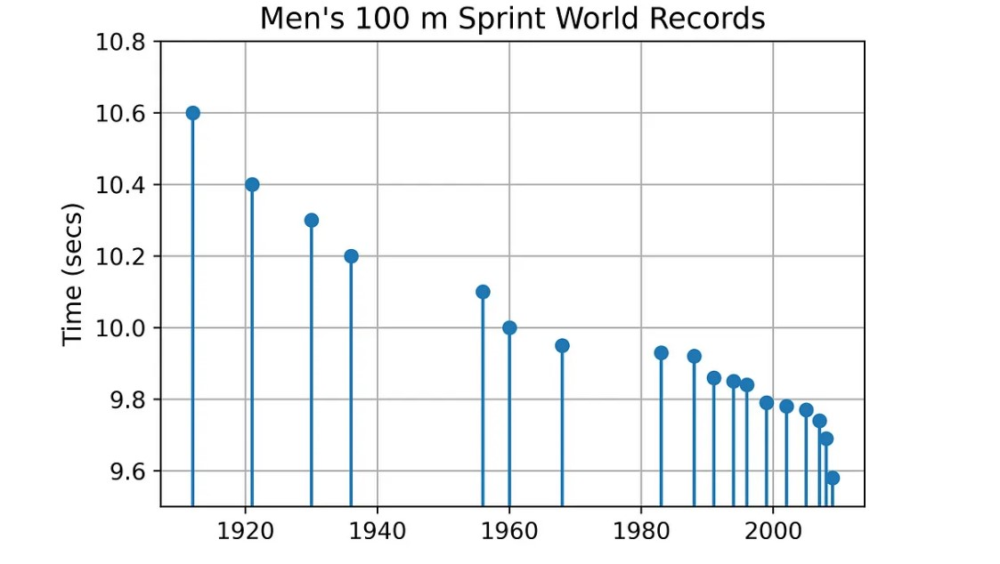

# Limits-of-Human-Performance
Prediction the Limits of Human Performance with Python with modeling exponential decay using SciPy.

About:
=====

Human performance, like many other traits, follows a [Bell Curve distribution](https://en.wikipedia.org/wiki/Normal_distribution). This means that most people fall within the average range, near the peak of the curve, with only a small percentage being exceptionally slow or fast. As we move farther away from the peak, the number of individuals with that level of performance drops off exponentially. In the case of sprinting, this means that the fastest sprinters have already reached the flattened, tapered part of the curve. As a result, making significant speed improvements will become increasingly difficult.

The SciPy Library:
======

The open-source SciPy library expands on NumPy by providing physical constants, conversion factors, and numerical routines for mathematics, science, and engineering use. These include optimization routines for curve fitting, which is just what we need for this project.

1. Scipy:  https://scipy.org

Steps to run the file:
=======

Step 1: Download the files and upload the .ipynb and the .csv file using either Google Colab or Jupyter Notebook.

Step 2: Once uploaded, for Google Colab run every cell starting from the first one to reach the output or click on "Run All" cells. For Jupyter notebook, install the required libraries in your Windows/MAC/Linux devices to run the code.

Step 3: Analyse the graph and the dataset along with the prediction of limits of the performance with the desired parameter and without the same.

 

